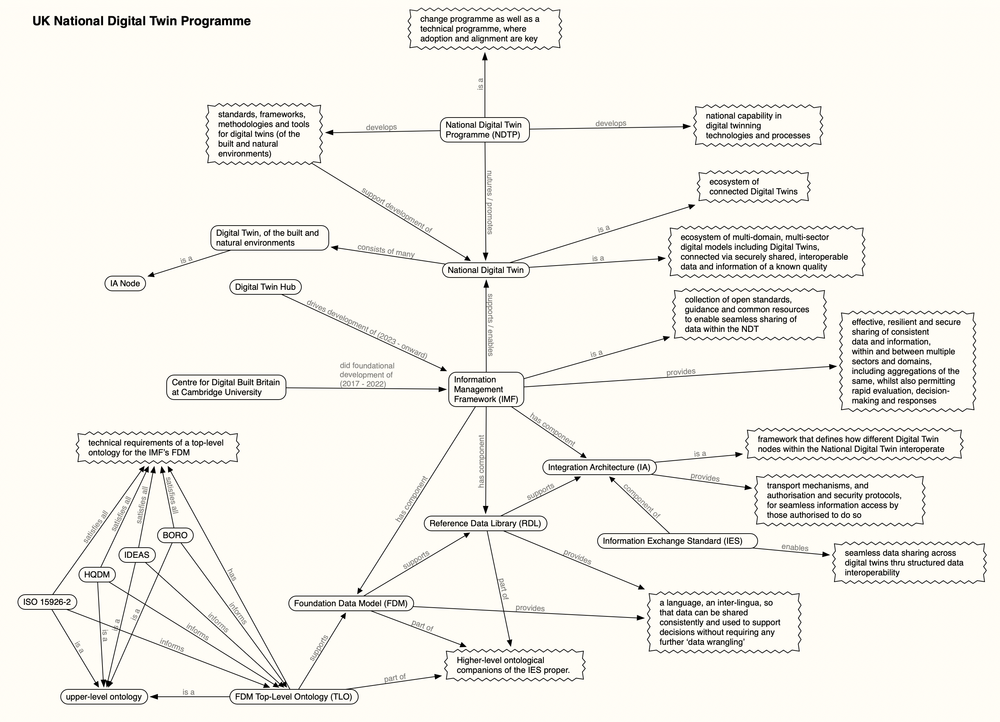

# IES

## Overview

**IES: Information Exchange Standard**

The Information Exchange Standard (IES) is a standard for information exchange developed within UK Government.

website:
* https://informationexchangestandard.org/
> A unified approach for seamless data exchange

GitHub IES organisation:
* https://github.com/IES-Org
> The GitHub organization for the Information Exchange Standard (IES)

Version 5 of IES was released on GitHub in November 2025. This is the version we have obtained for our DISO repository.

Version 5 of IES has **3 components**: 
* a top-level ontology (`ies-top`)
* a mid-level ontology (`ies-core`)
* and IES itself (`ies-common`)

`ies-top`
* https://github.com/IES-Org/ies-top
* the IES Top Ontology 
> A top level ontology grounded in Extensional Four-Dimensionalism
> IES-Top is an RDF top-level ontology which is based on the BORO Foundational Ontology and grounded in Extensional 4-Dimensionalism. It is also grounded in Pluralities, the Pluriverse and Constructionalism.
* see `ies-top.ttl`

`ies-core`
* https://github.com/IES-Org/ies-core
* the IES Core Ontology (ies-core) is
> A mid-level ontology built upon IES-Top providing a common foundational layer of patterns and concepts useful for expressing information in all manner of domains.
* see `ies-core.ttl`

`ies-common`
* https://github.com/IES-Org/ont-ies
* the Information Exchange Standard (IES)
> The home of the UK Government’s Information Exchange Standard, enabling consistent and open data exchange across domains.

Overview per https://github.com/IES-Org/ont-ies:
> The Information Exchange Standard (IES) is a UK Government initiative to support consistent, open, and interoperable data exchange. It provides a shared semantic foundation that enables public sector organisations to collaborate and integrate systems more effectively.
> The standard is designed to be modular and extensible, with support for evolving domain-specific extensions led by diverse teams across government.
> This repository is the official home of IES and includes documentation, example data, and ontology models to support adoption and use.

## Categorisation of IES within the DISO repository

Each of the 3 component ontologies of IES v5 arguably belongs in a different subdomain cluster within DISO:
* as a top-level ontology, `ies-top` fits nicely with the other `upper-level` ontologies in DISO
* as a mid-level ontology, `ies-core` fits nicely with the other `mid-level` ontologies in DISO
* as a domain-level ontology, `ies-common` fits best here in the `information-exchange` subdomain

However, rather than distribute IES assets throughout DISO, we have chosen to keep all IES assets together, in one place, and to use README files in the `upper-level` and `mid-level` folders to direct users to the `information-exchange` folder to find the IES top-level and mid-level ontologies, respectively.

## IES and Situation Awareness

The IES **information exchange** data model supports **situational awareness** (SA) even though it wasn't designed specifically with SA in mind.  That is, it supports the exchange of SA information along with other categories and domains of information as well.

There may be interesting overlaps between IES and JC3IEDM in this respect, and between IES and the SA-specific ontologies in the `situation-awareness` subdomain (cluster).

## IES and societal infrastructure

Applications of IES for data exchange extend well beyond the domains of defence and security as conventionally conceived. 

Per https://informationexchangestandard.org/about-the-ies/:
> Initially established within **defence and national security**, the standard has evolved into a cross-sector resource supporting a wide range of **industries, including buildings, transport and utilities**.

We refer to such assets as **societal infrastructure**. It is reasonable to regard societal infrastructure of this scale and scope as critical national assets with **national security relevance**.

## IES and UK's National Digital Twin Programme

A good example of a **societal infrastructure** application of the IES with clear national security dimensions is the UK's [National Digital Twin Programme](https://ndtp.co.uk/) (NDTP).  The IES plays a key role in the NDTP by enabling seamless data sharing across the ecosystem of diverse Digital Twins comprising the UK's National Digital Twin. The IES is a key component of the **Integration Architecture** (IA) layer in the **Information Management Framework** (IMF) of the UK's National Digital Twin. The IMF is the over-arching framework responsible for delivering effective, resilient and secure data sharing amongst Digital Twins. The IA is the component of the IMF responsible for providing the transport mechanisms, and authorisation and security protocols, that enable individual Digital Twins to interoperate within the National Digital Twin. The IES (and its companion, higher-level ontologies) is fundamental to the IA.

The following diagram (part knowledge graph, part mind map) provides a high-level, pictorial description of the UK's **National Digital Twin Programme**. It shows where the IES fits within the overall vision. It also shows the role played by **upper-level** ontologies within the overall **Information Management Framework** (IMF), and thereby reinforces their relevance to the domains of defence, intelligence and security.

